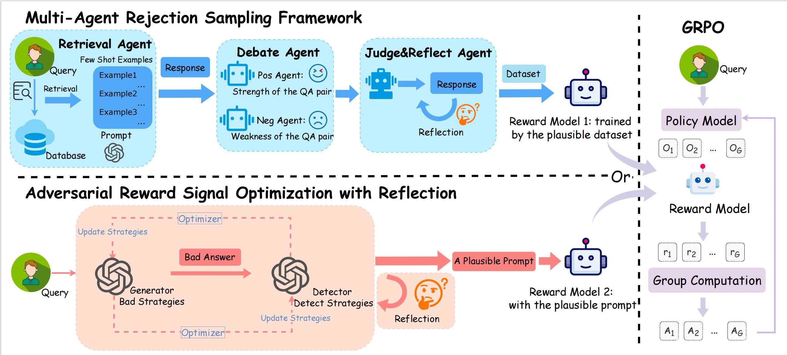

<div align="center">

<h2>Igniting Creative Writing in Small Language Models: LLM-as-a-Judge
versus Multi-Agent Refined Rewards</h2>

</div>

<div align="center">
  
</div>
This is the official repository for the paper "Igniting Creative Writing in Small Language Models: LLM-as-a-Judge
versus Multi-Agent Refined Rewards".

<div align="center">
    
</div>

## Key Features 

This project introduces novel strategies to enhance the creative writing capabilities of Small Language Models (SLMs) using Reinforcement Learning from AI Feedback (RLAIF). Our core contributions are:

*   **🚀 Two Distinct AI-driven Reward Strategies:** We systematically explore and compare two innovative approaches for generating reward signals to train creative SLMs, moving beyond costly human annotations:
    1.  **Multi-Agent Refined Reward Model:** A robust Reward Model (RM) trained on high-quality preference data curated by a sophisticated multi-agent system (Retrieval, Debate, Judge, and Reflect agents). This framework simulates a collaborative evaluation process to generate nuanced and bias-resistant preference labels.
    2.  **Principle-Guided LLM-as-a-Judge:** A more novel and efficient approach where a powerful LLM acts directly as a judge, providing reward signals. Its judgment is guided by explicit creative writing principles and is optimized through an adversarial training scheme with a reflection mechanism to improve its reliability.

*   **🏆 State-of-the-Art Performance on Creative Writing:** Our proposed **Principle-Guided LLM-as-a-Judge** approach achieves state-of-the-art generation quality in the creative task of generating Chinese greetings. It significantly outperforms strong baselines, including models trained with the multi-agent refined RM and even larger, more powerful LLMs like GPT-4o and Ernie-4.5.

*   **💡 High Efficiency and Scalability:** The LLM-as-a-Judge method demonstrates notable advantages in training efficiency. By eliminating the need for a separate, pre-trained reward model and reducing the dependency on extensive human-annotated preference data, it offers a more scalable and cost-effective path toward developing highly creative SLMs.

*   **📊 Strong Alignment with Human Judgment:** We conducted comprehensive experiments with both automated and human evaluations. Our results show that the automated evaluation frameworks (both the Multi-Agent system and the Adversarial Judge) exhibit a strong correlation (over 70-80% agreement) with human judgments, validating their effectiveness in assessing subjective qualities like creativity and emotional resonance.

*   **🔧 Open-Sourced Code and Reproducibility:** We provide the full implementation details, including training scripts and configurations for the GRPO algorithm, allowing for the complete reproduction of our experimental results. *(You can add this point if you are indeed open-sourcing the code.)*

## Getting Started 🔥


### Install dependencies

Run the following command to install the required dependencies for Supervised Fine-Tuning and Reward Model.

```bash
pip install torch==2.5.1 torchvision==0.20.1 torchaudio==2.5.1
pip install vllm==0.6.5
git clone --depth 1 https://github.com/hiyouga/LLaMA-Factory.git
cd LLaMA-Factory
pip install -e ".[metrics]"
```
---

Run the following command to install the required dependencies for Reinforcement Learning.

```bash
git clone https://github.com/volcengine/verl.git
cd verl
pip install --no-deps -e .
# Make sure you have activated verl conda env
# If you need to run with megatron
bash scripts/install_vllm_sglang_mcore.sh
# Or if you simply need to run with FSDP
USE_MEGATRON=0 bash scripts/install_vllm_sglang_mcore.sh
```
---


### Project Structure

```
.
├── dataset/                    # 📚 Stores all datasets for the experiments
│   ├── evaluation_set/         #   ├── Final evaluation set (2,000 labeled examples)
│   ├── grpo_data/              #   ├── Dataset for GRPO
│   ├── reward_model/           #   ├── Dataset for training the Reward Model
│   └── sft/                    #   ├── Dataset for Supervised Fine-Tuning (SFT)
│
├── multi_agent/                # 🤖 Implementation of the Multi-Agent Rejection Sampling Framework
│   ├── retrieval_agent.py      #   ├── 1. Retrieval Agent: Retrieves high-quality examples from the database
│   ├── pos_agent.py            #   ├── 2a. Positive Agent: Argues from a positive perspective
│   ├── neg_agent.py            #   ├── 2b. Negative Agent: Argues from a negative perspective
│   ├── judge_agent.py          #   ├── 3. Judge Agent: Forms a preliminary judgment based on the debate
│   └── reflect_agent.py        #   └── 4. Reflect Agent: Reviews and finalizes the evaluation result
│
├── adversarial/                # ⚔️ Implementation of the Adversarial Reward Signal Optimization Framework
│   ├── main.py                 #   ├── The main part of the adversarial framework
│
├── scripts/                    # 🚀 Scripts for training
│   ├── run_grpo.sh             #   ├──  Script for running GRPO Reinforcement Learning
│
└── README.md                   # 📝 Project Overview
```

---

### Directory and File Descriptions

#### `dataset/`
This directory serves as the data hub for the project, centralizing all data required for training, evaluation, and inference.

*   **`evaluation_set/`**: A hold-out golden set of **2,000** meticulously labeled examples. This independent test set is used for the final, fair performance evaluation of all models, ensuring the objectivity of our results.
*   **`grpo_data/`**: Contains a set of 4,000 diverse, unlabeled prompts. This data serves as the input for the policy model during the reinforcement learning phase.
*   **`reward_model/`**: Houses the preference dataset `(prompt, chosen_response, rejected_response)` used to train the **Multi-Agent Refined Reward Model**. This data is automatically generated by the `multi_agent` framework.
*   **`sft_data/`**: Contains high-quality `(prompt, response)` pairs for **Supervised Fine-Tuning (SFT)**. This stage provides a strong **cold-start** version of the model for subsequent reinforcement learning, equipping it with the fundamental capabilities required for the task.

#### `multi_agent/`
This directory contains the full implementation of the **Multi-Agent Rejection Sampling Framework** proposed in the paper. This framework automates the generation of high-quality preference data by simulating a collaborative "Retrieve-Debate-Judge-Reflect" evaluation pipeline, which provides the data foundation for training a powerful reward model.

*   `retrieval_agent.py`: The **Retrieval Agent**, which retrieves high-quality examples from the database that are semantically similar to the current query.
*   `pos_agent.py` & `neg_agent.py`: The **Debate Agents**, acting as a "proponent" and "opponent" respectively, to conduct a comprehensive, structured analysis of the generated content from both positive and negative viewpoints.
*   `judge_agent.py`: The **Judge Agent**, which synthesizes the arguments from the debate to form a preliminary, holistic judgment.
*   `reflect_agent.py`: The **Reflect Agent**, which acts as a reviewer to audit the judgment process, correct potential biases, and ensure the reliability of the final outcome.

#### `adversarial/`
This directory contains the full implementation of the **Adversarial Reward Signal Optimization Framework**. This is the core of the "LLM-as-a-Judge" strategy, which does not rely on a static, pre-trained reward model. Instead, it generates and refines reward signals dynamically through an adversarial game.

*   `main.py`: The main entry point that orchestrates the entire adversarial learning process. It drives the iterative feedback loops between the Generator, Detector, and Reflector to dynamically evolve and optimize the strategies, ultimately producing the refined prompt for the LLM-as-a-Judge.


---
### Running the Experiments

This guide provides a step-by-step walkthrough to reproduce the experiments presented in the paper. The workflow is divided into two main paths for generating AI feedback, followed by the model training stages.

*   **Path A: Multi-Agent Reward Model (Steps 1 & 3)**
*   **Path B: Adversarial LLM-as-a-Judge (Step 2)**

You will then use these reward mechanisms to train the final model (Steps 4 & 5).

---

#### Step 1: Generate Preference Data with the Multi-Agent Framework

This step runs the **Multi-Agent Rejection Sampling Framework** to automatically generate the `(prompt, chosen, rejected)` preference dataset. This data is required for training the reward model in Step 3.

**1. Configuration:**

The agents in this framework rely on a powerful LLM API (e.g., OpenAI, Anthropic, or a self-hosted API endpoint). Before running, you must configure your credentials. We recommend using environment variables:

```bash
export MODEL="deepseek-V3"
export URL="https://api.openai.com/v1/chat/completions"
export AUTHORIZATION="Bearer sk-..."
```

**2. Execution:**

The framework consists of a sequence of scripts that must be run in order. We provide a wrapper script to simplify this process, or you can run them individually.

```bash
python multi_agent/retrieval_agent.py 
python multi_agent/pos_agent.py 
python multi_agent/neg_agent.py 
python multi_agent/judge_agent.py 
python multi_agent/reflect_agent.py 
```


---

#### Step 2: Optimize the LLM-as-a-Judge Reward Signal

This step runs the **Adversarial Reward Signal Optimization with Reflection** framework. This is the alternative to Step 1 and 3. Instead of producing a dataset, its goal is to optimize the logic (e.g., a system prompt or a set of principles) for the LLM-as-a-Judge, which will be used directly as a reward function in Step 5.

**1. Configuration:**

Similar to Step 1, this framework also requires access to a powerful LLM API. Please ensure your environment variables are set.

**2. Execution:**

The adversarial training process is initiated by running the main script in the `adversarial` directory.

```bash
python adversarial/main.py 
```

---

#### Step 3: Train the Refined Reward Model and Supervised Fine-Tuning (SFT)

This step trains the reward model (RM) using the preference data generated in **Step 1**.You can also train an SFT model using the data in dataset/sft_data/ to serve as a cold-start for the GRPO training.
We use [LLaMA Factory](https://github.com/hiyouga/LLaMA-Factory) for this stage.

---

#### Step 4: Run Reinforcement Learning with GRPO

This is the final stage where we optimize the SFT model from **Step 3** using the GRPO algorithm.We use [Verl](https://github.com/volcengine/verl) for this stage.

*   **Function**: The `run_grpo.sh` script must be configured to use one of the two AI feedback sources:
    1.  **For Path A**: Modify the script to load the Reward Model trained in **Step 3**.
    2.  **For Path B**: Modify the script to use the LLM-as-a-Judge logic optimized in **Step 2**.
*   **Command**:
    ```bash
    bash scripts/run_grpo.sh
    ```


---
